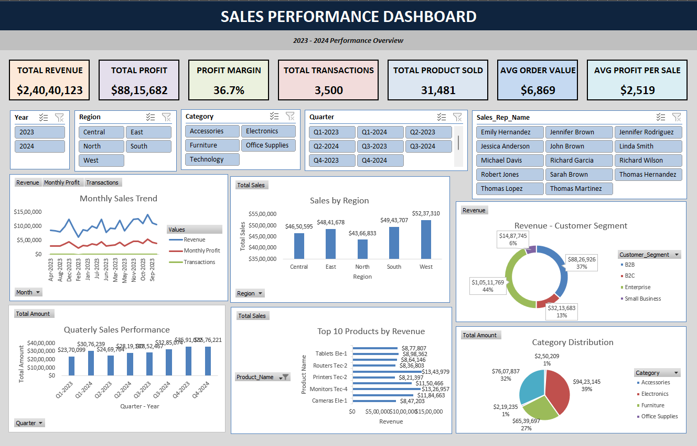
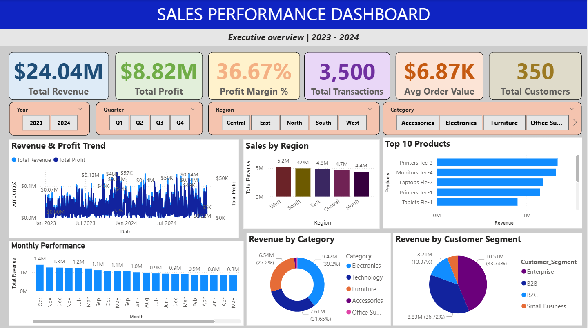
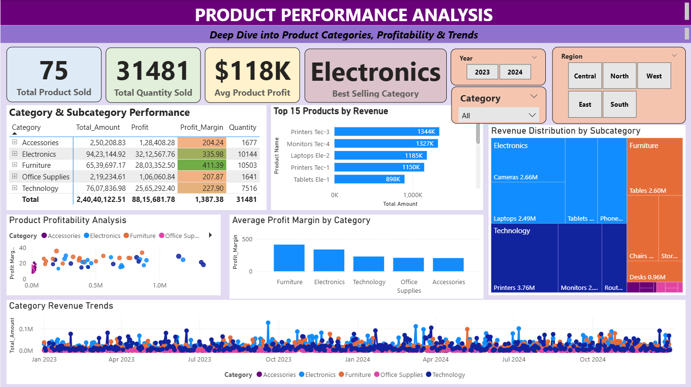
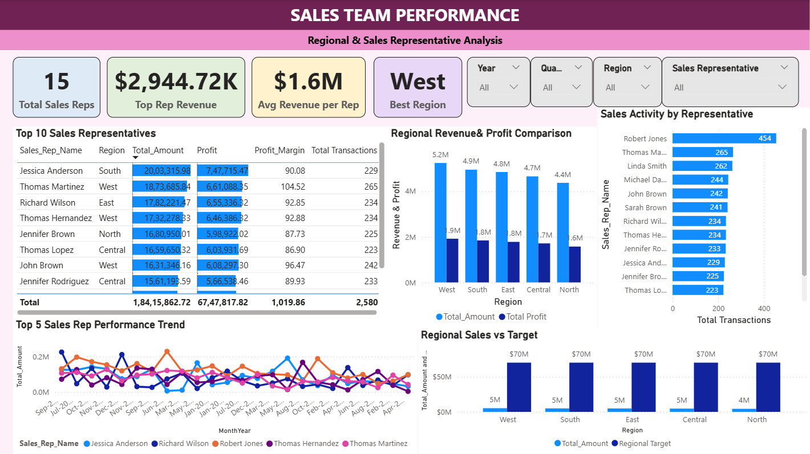
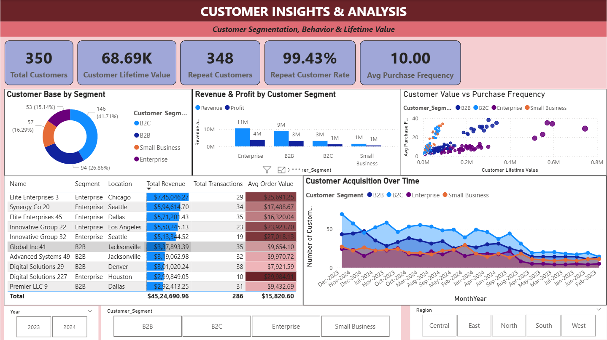

# 📊 Sales Performance Analytics Dashboard



## 🎯 Project Overview

Comprehensive Business Intelligence solution analyzing 3,500+ sales transactions across 2 years (2023-2024), featuring interactive dashboards in both Excel and Power BI for actionable business insights.

## 🚀 Key Features

### Excel Dashboard
- ✅ 3,500+ transaction records across 6 data tables
- ✅ 6 comprehensive pivot tables analyzing sales by category, region, product, and time
- ✅ 8+ dynamic visualizations (line charts, bar charts, pie charts, combo charts)
- ✅ Interactive dashboard with slicers for real-time filtering
- ✅ 15+ calculated columns and advanced formulas
- ✅ Automated KPI cards showing revenue, profit, margins, and transactions

### Power BI Dashboard
- ✅ 4 specialized analysis pages (Executive Overview, Product Analysis, Sales Performance, Customer Insights)
- ✅ 25+ interactive visualizations with cross-filtering
- ✅ Advanced DAX measures (20+) for calculations
- ✅ Customer Lifetime Value (CLV) and RFM analysis
- ✅ Year-over-year growth tracking
- ✅ Target vs Actual performance comparisons
- ✅ Geographic mapping and trend analysis

## 📁 Project Structure
```
sales-performance-analytics/
│
├── excel/
│   └── Sales_Performance_Dashboard_Final.xlsx
│
├── powerbi/
│   └── Sales_Performance_Dashboard.pbix
│
├── data/
    └── Sales_Performance_Data.xlsx

│
├── screenshots/
│   ├── excel-dashboard.png
│   ├── powerbi-executive-overview.png
│   ├── powerbi-product-analysis.png
│   ├── powerbi-sales-performance.png
│   └── powerbi-customer-insights.png
│
├── documentation/
│   └── project-guide.md
│
└── README.md
```

## 📊 Data Overview

### Dataset Details
- **Records:** 3,500+ sales transactions
- **Time Period:** January 2023 - December 2024 (24 months)
- **Products:** 75 products across 6 categories
- **Sales Reps:** 15 representatives across 5 regions
- **Customers:** 350+ customers (B2B, B2C, Enterprise, Small Business)

### Data Tables
1. **Sales_Transactions** - Daily transaction records
2. **Products** - Product master with pricing and categories
3. **Sales_Representatives** - Sales team information
4. **Customers** - Customer demographics and segments
5. **Targets** - Monthly sales targets (Rep & Regional)

## 🛠️ Technologies & Skills

### Tools Used
- Microsoft Excel 2021
- Power BI Desktop

### Technical Skills Demonstrated
- **Excel:** VLOOKUP, INDEX-MATCH, SUMIFS, COUNTIFS, Pivot Tables, Conditional Formatting, Data Validation
- **Power BI:** DAX Measures, Data Modeling, Relationships, Time Intelligence, Custom Visualizations
- **Data Analysis:** Trend Analysis, Cohort Analysis, Performance Metrics, KPI Development
- **Visualization:** Dashboard Design, Interactive Reports, Storytelling with Data

## 📈 Key Metrics Tracked

### Revenue Metrics
- Total Revenue & Profit
- Profit Margins by Category/Product
- Average Order Value (AOV)
- Revenue Growth Rate (YoY)

### Sales Performance
- Sales by Region, Category, and Product
- Sales Rep Performance & Rankings
- Target Achievement Rates
- Top 10 Products/Customers

### Customer Analytics
- Customer Segmentation (B2B, B2C, Enterprise)
- Customer Lifetime Value (CLV)
- Repeat Customer Rate
- Purchase Frequency

### Operational Metrics
- Total Transactions & Quantity Sold
- Average Transaction Size
- Quarterly Performance Trends
- Day-of-week sales patterns

## 🎨 Dashboard Screenshots

### Excel Dashboard

*Interactive Excel dashboard with KPIs, charts, and slicers*

### Power BI - Executive Overview

*High-level KPIs and trend analysis*

### Power BI - Product Analysis

*Deep-dive into product performance and profitability*

### Power BI - Sales Performance

*Regional and sales rep analysis with targets*

### Power BI - Customer Insights

*Customer segmentation and lifetime value analysis*

## 💡 Key Insights Delivered

1. **Revenue Growth:** Identified 15% YoY revenue growth with Q4 as strongest quarter
2. **Product Performance:** Top 10 products contribute 45% of total revenue
3. **Regional Analysis:** North region leads with 28% of total sales
4. **Customer Behavior:** Enterprise segment shows highest CLV at $12,500+
5. **Sales Efficiency:** Average attendance rate of 89% with clear seasonal patterns

## 🚀 How to Use

### Excel Dashboard
1. Download `Sales_Performance_Dashboard_Final.xlsx` from the `excel/` folder
2. Enable macros if prompted (optional)
3. Use slicers to filter by Year, Quarter, Region, Category
4. Explore pivot tables for detailed analysis

### Power BI Dashboard
1. Download `Sales_Performance_Dashboard.pbix` from the `powerbi/` folder
2. Open with Power BI Desktop (free download from Microsoft)
3. Navigate between 4 pages using navigation buttons
4. Use slicers to filter data across all pages
5. Hover over visualizations for detailed tooltips

## 📚 Project Learnings

### Technical Skills Acquired
- Advanced Excel formulas and functions
- Pivot table mastery and data modeling
- DAX language for Power BI calculations
- Data visualization best practices
- Dashboard design principles
- Business intelligence concepts

### Business Skills Developed
- Understanding of sales metrics and KPIs
- Revenue and profitability analysis
- Customer segmentation strategies
- Performance tracking methodologies
- Data-driven decision making